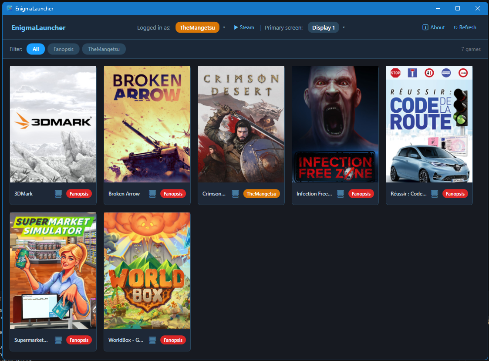

<div align="center">

# EnigmaLauncher

**Smart game launcher for multi-monitor, multi-account Windows setups.**

[](https://www.microsoft.com/windows)
[](https://dotnet.microsoft.com/download/dotnet/8)
[](LICENSE)
[](https://store.steampowered.com)



</div>

---

## What is this?

If you share a Windows PC with multiple Steam accounts (or just keep two accounts yourself),
switching between them to play a game is tedious: sign out, sign in, wait, launch.

EnigmaLauncher fixes that. Create a desktop shortcut for any game. Double-click it — the app
detects which account owns the game, silently restarts Steam under the right account, and
launches the game. No dialog boxes, no password prompts, no manual steps.

## Features

- 🎮 **Unified library** — one grid showing every installed game across all your accounts
- 🔄 **Silent account switching** — kills Steam, patches the right config files, restarts it, and signs in automatically
- 🖼️ **Game artwork** — pulls capsule art from Steam's local cache; downloads from CDN if missing
- 🏷️ **Account filter** — click an account pill to see only their games
- 🔗 **Desktop shortcuts** — generate per-game `.lnk` files with the game's own icon
- 👤 **Header account switcher** — switch accounts directly from the main window without launching a game
- ▶ **Start Steam** — open the Steam client directly from the header without launching a game
- 📚 **Open in Steam Library** — open a card's game details, switching to its owner account first when needed
- ⚡ **Zero config** — Steam path and all accounts detected automatically from the Windows registry

## How it works

When you double-click a game shortcut:

1. Reads the current Steam session from the Windows registry (`ActiveProcess\ActiveUser`)
2. Reads the game's owner from its `.acf` manifest (`LastOwner` field)
3. If a switch is needed, it:
   - Writes `AutoLoginUser` to the registry
   - Patches `loginusers.vdf` (sets `MostRecent`, `AllowAutoLogin`, and `Timestamp` for the target account)
   - Kills all Steam processes, applies the account changes, then starts Steam once with `-silent`
   - Waits for `ActiveProcess\ActiveUser` to become non-zero (signed in)
   - Fires `steam://rungameid/<appid>` at the running client → game launches

See [`docs/architecture.md`](docs/architecture.md) for the full technical breakdown.

## Requirements

- Windows 10 or 11 (64-bit)
- [Steam](https://store.steampowered.com/about/) installed
- Each account must have been signed into at least once with **"Remember me"** checked

## Installation

### Option A — Build from source (recommended)

```cmd
git clone https://github.com/Mangetsu/steam-account-switcher.git
cd steam-account-switcher
build.bat
```

The app is published to `%LOCALAPPDATA%\EnigmaLauncher\EnigmaLauncher.exe`.

### Option B — Download release

Download the latest zip from the [Releases](../../releases) page, extract it to
`%LOCALAPPDATA%\EnigmaLauncher\`, and run `EnigmaLauncher.exe`.

### Antivirus note

The binary is **not code-signed** (a certificate costs ~$300/year). Reputation-based AV engines
(Norton, Defender SmartScreen) may flag it on first run because they've never seen this specific
file before. This is a false positive.

Fix: add `%LOCALAPPDATA%\EnigmaLauncher` to your AV exclusion list, then restore the file from
quarantine. See [`docs/building.md`](docs/building.md#antivirus-exclusion) for per-AV instructions.

## Usage

### Main window

Run `EnigmaLauncher.exe` with no arguments to open the library GUI:

- **Grid** — all installed games across all accounts, with artwork and owner badges
- **Filter bar** — click an account name to show only their games
- **Play (hover)** — hover a card and click ▶ to launch the game (switches account if needed)
- **Shortcut (hover)** — hover a card and click 🔗 to create a desktop shortcut
- **Account badge (header)** — click the account name + ▾ to switch accounts
- **Steam button (header)** — start or focus Steam without launching a game
- **Open in Steam Library (game card)** — switch to the card's owner account when needed, then open its Library details page without launching it

### Shortcuts

Click **Create Shortcut** on any game card. A `.lnk` is placed on your Desktop:

```
Target:   %LOCALAPPDATA%\EnigmaLauncher\EnigmaLauncher.exe  --launch <appid>
Icon:     game capsule art converted to .ico
```

Double-clicking the shortcut runs the full switch + launch flow headlessly.

## Project structure

```
EnigmaLauncher/
├── EnigmaLauncher/         # C# WPF project (.NET 8)
│   ├── Steam/              # Steam integration (config, accounts, switcher, scanner, artwork)
│   ├── UI/                 # WPF windows, controls, dark theme
│   │   ├── Controls/       # GameCard, AccountBadge reusable controls
│   │   └── Styles/         # ResourceDictionary (Theme.xaml)
│   ├── Shortcuts/          # .lnk creation via WScript.Shell COM
│   └── Assets/             # app_icon.ico
├── docs/
│   ├── architecture.md     # Technical deep-dive
│   └── building.md         # Build instructions, dependencies
├── scripts/
│   └── Publish-CleanLayout.ps1  # Post-publish install layout script
├── .editorconfig
├── .gitignore
├── build.bat               # One-click publish script
├── CHANGELOG.md
├── LICENSE
└── EnigmaLauncher.sln
```

## Contributing

Issues and pull requests are welcome.

- Open an issue first for any significant change so we can discuss it
- Keep PRs focused — one feature or fix per PR
- Follow the existing code style (enforced via `.editorconfig`)

## License

[PolyForm Noncommercial 1.0.0](LICENSE) © 2026 Badr Hakkari
